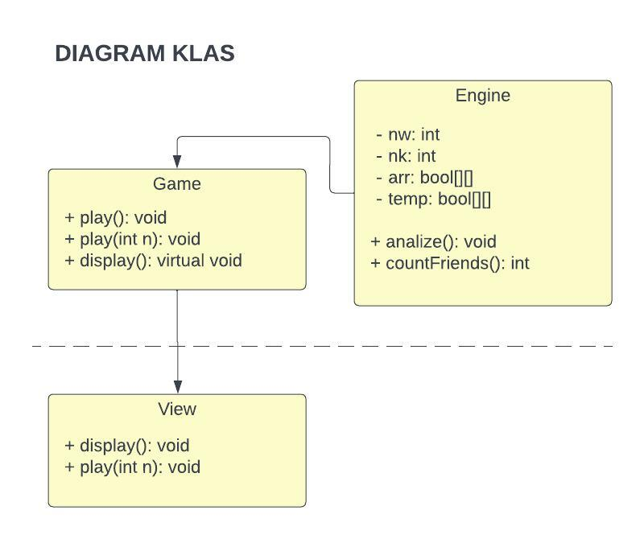

# Gra w życie
### Autor
Adrian Sudak


### Opis
Gra w życie to gra komórkowa wymyślona przez brytyjskiego matematyka Johna Hortona Conwaya w 1970 roku. Jest to przykład automatu komórkowego, w którym stan każdej komórki na dwuwymiarowej siatce jest aktualizowany w oparciu o stany jej sąsiadów w poprzednim kroku.
[Czytaj dalej (Wkipedia)](https://pl.wikipedia.org/wiki/Gra_w_%C5%BCycie)


### Struktura klas
Program zawiera trzy klasy: Engine, Game i View o danych własnościach:


### Instrukcja obsługi
Do uruchomienia programu wystarczy potrzebny jest plik `database.txt` z którego konstruktor klasy Engine wczyta początkową zawartość planszy.  

By wyświetlić zawartośc planszy wraz z następnym pokoleniem należy w `main.cpp`:
```C++
View game("database.txt");
game.play();
```

| Wywołanie     |        Parametr        | Działanie                                                                                               |
|---------------|:----------------------:|:--------------------------------------------------------------------------------------------------------|
| play()        |           -            | Pętla nigdy się nie kończy. Przejście do następnego pokolenia następuje po naciśnięciu klawisza `Enter` |
| play(5)       | `int n` - ilość pokoleń | Program wykonuje się `n` razy, a następnie wyświetla ostateczny wynik planszy.                          |
 


### Wymagania sprzętowe i systemowe
**- Minimalne -**  
  System Windows XP (SP3) lub nowszy  
  Procesor Intel Core 2 Duo 1,8 GHz lub AMD Athlon 64 4000+ 2,4 GHz  
  Pamięć RAM: 512 MB  
  Karta graficzna: Zintegrowana lub dedykowana z obsługą DirectX 9.0c  
  Dysk twardy: 256MB wolnego miejsca  

**- Zalecane -**  
  System Windows 7 lub nowszy  
  Procesor Intel Core i3 lub AMD Phenom II X4 2,5 GHz  
  Pamięć RAM: 1 GB  
  Karta graficzna: NVIDIA GeForce GTX 650 lub AMD Radeon HD 7770  
  Dysk twardy: 1 GB wolnego miejsca  
